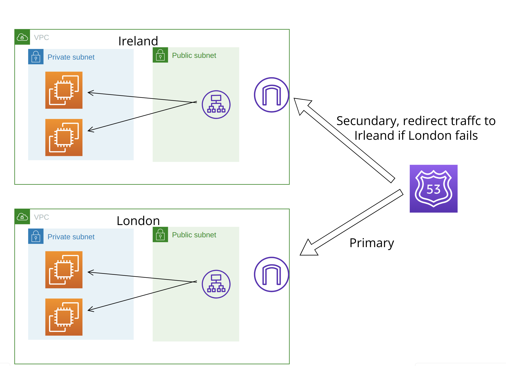

# aws-terraform

## Introduction
Terraform recipies for multiple AWS architectural patterns. Repository is intended for  learning purposes and not for 
commercialization.

## Requirements
If anyone would like to try to deploy these recipies on their AWS accounts from their local devices, these 2 requirements
must be met.  
1 - Terraform-cli installed locally, https://developer.hashicorp.com/terraform/tutorials/aws-get-started/install-cli
2 - aws-cli installed with aws credentials that are allowed to deploy components defined on terraform code.

## Applications

### simple-app-fail-over
Simple application that has a fail-over strategy, application is deployed on 2 aws regions (London and Ireland), 
route 53 directs all traffic to the London region BUT when the London region fails, the traffic is automatically 
redirected to the Ireland Region, look at the diagram below.  

)

The web application is very simple, it runs on EC2s that are managed by an auto-scaling group with a maximum of 3 instances
and a minimum of 2, the application just prints the aws region where the EC2 is located. Traffic enters by an Application
Load Balancer. The primary region is the London region, The traffic is directed to the London region as long as the Load 
Balancer is returning 200 response. Route 53 redirects traffic to Ireland region when the Load balancer at the London
region returns non 2xx response.

#### How to test the fail-over.
After you have deployed the application to both regions, you can see that the response comes from EC2s on eu-west-2a/eu-west-2b 
which are London Availability Zones, you can create a failure by simply changing the security group on the London region
for the Load balancer to NOT allow any income traffic, that will create a fail-over and after 3 to 5 minutes you can 
see that web app response is now coming from EC2s located at eu-west-1a/eu-west-2b which are from Ireland.

